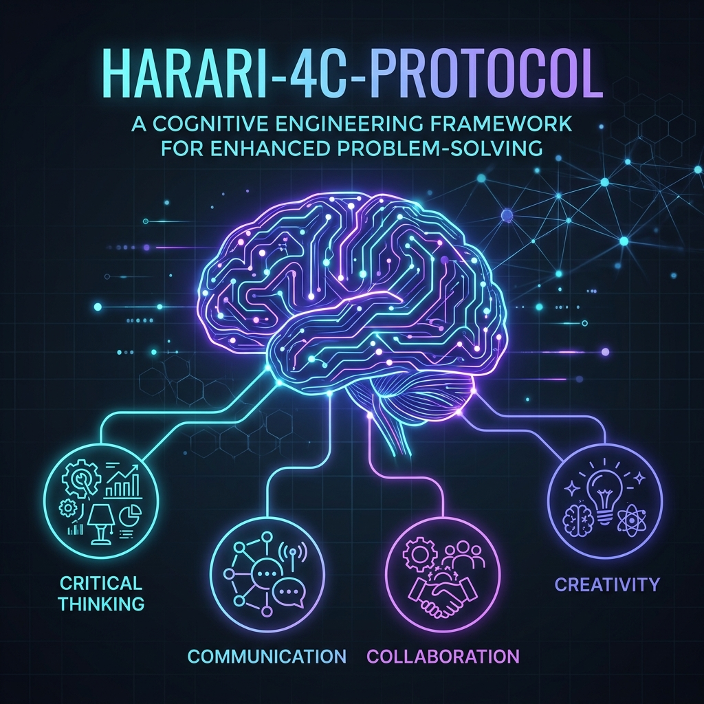

# Harari-4C-Protocol

## 📌 Giriş
Dünya, tarihin en hızlı teknolojik dönüşüm sürecinden geçerken, bireylerin ve sistemlerin ayakta kalması artık sadece "statik bilgi" ile mümkün değildir. Yuval Noah Harari'nin *21. Yüzyıl için 21 Ders* eserinde formüle ettiği **4C Kuralı**, modern insanın ve geleceğin otonom sistemlerinin "bilişsel işletim sistemi" (Cognitive OS) olarak kabul edilmelidir.

**Harari-4C-Protocol**, bu dört temel sütunu (Critical Thinking, Communication, Collaboration, Creativity) birer soyut kavram olmaktan çıkarıp, mühendislik disipliniyle yapılandırılmış bir "kişisel gelişim ve sistem mimarisi" çerçevesine dönüştürmeyi amaçlar.

---

## 🏗 Protokolün Temel Sütunları

### 1. Critical Thinking (Eleştirel Düşünme)
*Bilgiyi Filtreleme ve Algoritmik Doğrulama*
- **Tanım:** Devasa veri yığınları içinden anlamlı olanı süzme, dezenformasyonu tespit etme ve mantıksal safsatalardan arınma yetisi.
- **Uygulama:** Veri analitiği süreçlerinde "Bias" (yanlılık) tespiti, AI modellerinde halüsinasyon kontrolü ve karar destek sistemlerinde rasyonel optimizasyon.

### 2. Communication (İletişim)
*İnsan-Makine ve Disiplinlerarası Etkileşim*
- **Tanım:** Karmaşık fikirleri farklı katmanlardaki alıcılara (insan veya yapay zeka) en verimli şekilde aktarma becerisi.
- **Uygulama:** Prompt Engineering (İstemi Mühendisliği), teknik dokümantasyon standartları ve yüksek düzeyli sistem mimarilerinin sadeleştirilmiş temsili.

### 3. Collaboration (İş Birliği)
*Ekosistem Entegrasyonu ve Swarm Intelligence*
- **Tanım:** Farklı disiplinlerin, modüllerin ve bireylerin ortak bir amaç doğrultusunda senkronize çalışması.
- **Uygulama:** Açık kaynak katkı protokolleri, ROS2 tabanlı sürü sistemleri etkileşimi ve çevik (Agile) yönetim metodolojileri.

### 4. Creativity (Yaratıcılık)
*Adaptasyon ve Yenilikçi Çözüm Üretimi*
- **Tanım:** Mevcut kalıpların dışına çıkarak, öngörülemeyen problemler için esnek ve özgün stratejiler geliştirme.
- **Uygulama:** Security-by-Design yaklaşımları, düşük kaynaklı (Edge-AI) sistemler için optimizasyon mimarileri ve ontolojik veri modelleme.

## 📂 Proje Yapısı ve Bileşenler

Bu repository, Harari-4C-Protocol'ü dört ana modülde somutlaştırmaktadır:

### 1. [Critical Thinking (Eleştirel Düşünme)](./01-critical-thinking/)
-   **[bias_analyzer.py](./01-critical-thinking/bias_analyzer.py):** Metinlerdeki bilişsel yanlılıkları ve safsataları tespit eden heuristik araç.
-   **[fallacy_guide.md](./01-critical-thinking/fallacy_guide.md):** Mantıksal safsatalar ve algoritmik doğrulama rehberi.

### 2. [Communication (İletişim)](./02-communication/)
-   **[prompt_engine.json](./02-communication/prompt_engine.json):** İnsan-Makine etkileşimi için mühendislik düzeyi istem (prompt) kütüphanesi.
-   **[tech_doc_standard.md](./02-communication/tech_doc_standard.md):** Bilişsel yükü minimize eden teknik dökümantasyon standartları.

### 3. [Collaboration (İş Birliği)](./03-collaboration/)
-   **[swarm_sim.py](./03-collaboration/swarm_sim.py):** Kolektif bilginin hızı nasıl artırdığını gösteren sürü zekası simülasyonu.
-   **[contribution_flow.md](./03-collaboration/contribution_flow.md):** Merkeziyetsiz ekipler için katkı ve senkronizasyon protokolü.

### 4. [Creativity (Yaratıcılık)](./04-creativity/)
-   **[ontological_modeler.py](./04-creativity/ontological_modeler.py):** Karmaşık sistemlerin "DNA"sını çıkaran ontolojik modelleme aracı.
-   **[security_patterns.md](./04-creativity/security_patterns.md):** Güvenliği yaratıcı bir kısıt olarak ele alan "Security-by-Design" rehberi.

---

## 🖥️ Bilişsel İşletim Sistemi Arayüzü (Dashboard)
Projenin temel prensiplerini ve modüllerini görselleştiren modern bir arayüz geliştirilmiştir.
-   **[Web Dashboard](./web/index.html)** - *Modern, karanlık mod destekli interaktif arayüz.*

---

## 🎯 Hedef ve Vizyon
Bu protokol, bir mühendisin sadece kod yazan veya sistem kuran biri değil, aynı zamanda **belirsizliğe karşı dirençli bir mimar** olmasını savunur. Proje kapsamında, bu dört yetkinliğin günlük iş akışlarına (Workflow), yazılım geliştirme süreçlerine ve stratejik karar alma mekanizmalarına nasıl entegre edileceğine dair metodolojiler geliştirilmiştir.

---

## 🛠 Kullanım Şekli
Bu depo (repository), aşağıdaki alanlarda rehberlik etmek üzere tasarlanmıştır:
- **Kişisel Gelişim:** 21. yüzyıl yetkinliklerini bir mühendislik disipliniyle takip etmek.
- **Sistem Tasarımı:** Modüler ve esnek mimariler inşa ederken "4C" prensiplerini check-list olarak kullanmak.
- **Eğitim ve Mentorluk:** Yeni nesil mühendis adayları için bir yol haritası sunmak.

---

## 📜 Lisans
Bu proje [MIT Lisansı](LICENSE) altında lisanslanmıştır.

---

> *"Değişmeyen tek şey değişimin kendisidir ve bu değişimde hayatta kalmanın yolu, bilişsel esneklikten geçer."*

